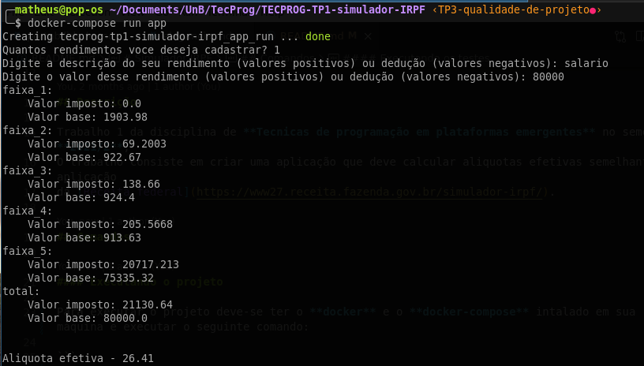
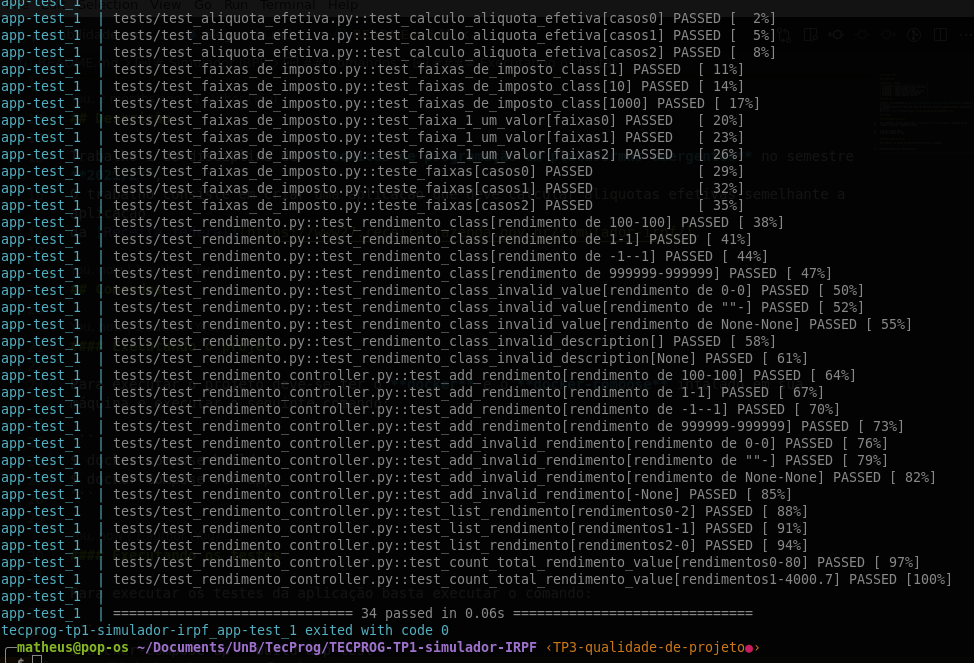

# Simulador IRPF

## Integrantes

| Matrícula  | Aluno                           |
| ---------- | ------------------------------- |
| 18/0106970 | Matheus Gabriel Alves Rodrigues |
| 18/0113151 | Eduardo Nunes Picolo            |
| 18/0129287 | Pedro Henrique Vieira de Lima   |
| 14/0065547 | Roberto Martins da Nóbrega      |
| 18/0130722 | Samuel Nogueira Bacelar         |

## Descrição

Trabalho 1 da disciplina de **Tecnicas de programação em plataformas emergentes** no semestre **2021/2**,
O trabalho consiste em criar uma aplicação que deve calcular aliquotas efetivas semelhante a aplicação
da [Receita federal](https://www27.receita.fazenda.gov.br/simulador-irpf/).


## Comandos

#### Executando o projeto

Para executar o projeto deve-se ter o **docker** e o **docker-compose** intalado em sua máquina e executar o seguinte comando:

```
$ docker-compose build
$ docker-compose run app
```



#### Executando os testes

Para executar os testes da aplicação basta executar o comando:

```
$ docker-compose up --build app-test
```


#### Tecnologias utilizados

* Python
* Docker
* Docker-compose
* Pytest
