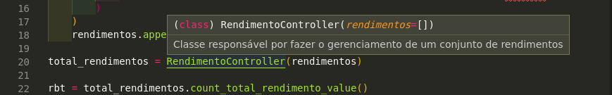

# Boa Documentação

## Conceito

Um projeto bem documentado é de extrema importância para o entendimento do seu propósito, tanto para outros desenvolvedores como para leigos que necessitam de utilizar desse projeto, ao documentar um projeto facilitará identificar as tecnologias utilizadas, a finalidade e importância do projeto e auxiliar na sua utilização.

## Implementação

Para implementar esse módulo de boa documentação o grupo utilizou desde o inicio do projeto o arquivo `README.md` e boas mensagens para os commits no repositório do projeto.

Nessa refatoração o grupo melhorou a documentação do `README.md` adicionando tópicos, imagens, etc. Nós também utilizamos documentação via comentário adicionando descrições nas classes do projeto.

Essa documentação via código é importante para auxiliar o entendimento do código e também o desenvolvimento do mesmo, como mostra a imagem a seguir.

### Arquivos

* `src/models/Faixa_de_imposto.py`
* `src/models/Aliquota_efetiva.py`
* `src/models/Rendimento.py`
* `src/exceptions/DescricaoEmBrancoException.py`
* `src/exceptions/ValorRendimentoInvalidoException.py`
* `src/controllers/RendimentoController.py`
* `README.md`

### Mal cheiros

O grupo identificou os seguintes mal cheiros nos códigos refatorados:

* Comentários
